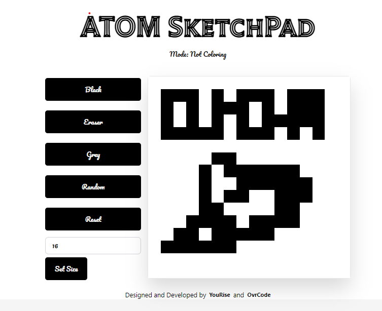

# Etch-A-Sketch Project

## Introduction

This is a project from The Odin Project. The goal is to create a browser version of something between a sketchpad and an Etch-A-Sketch. The user should be able to create a grid of squares representing their design, and apply colors to those squares to create a digital masterpiece!

<!-- GIF  -->

## Features

### 1. Create a grid of squares representing their design

- The user can create a grid of squares representing their design
- The user can choose the size of the grid
- The user can choose the color of the grid

### 2. Apply colors to those squares to create a digital masterpiece!

- The user can apply colors to those squares to create a digital masterpiece!

## Technologies

- HTML
- CSS
- TailwindCSS
- JavaScript

## Installation

- Clone the repository
- Open the index.html file in your browser
- Enjoy!

## Live Demo

[Click here](https://raw.githack.com/ahmetbozaci/etch-a-sketch/master/index.html)

## Author

👤 **Pruthviraj Chauhan**

- Github: [@ovr-code](https://github.com/ovr-code)
- Twitter: [@**ovrCode**](https://twitter.com/__ovrCode__)

## 🤝 Contributing

Contributions, issues and feature requests are welcome!

## Show your support

Give a ⭐️ if you like this project!

## Acknowledgments

- The Odin Project

